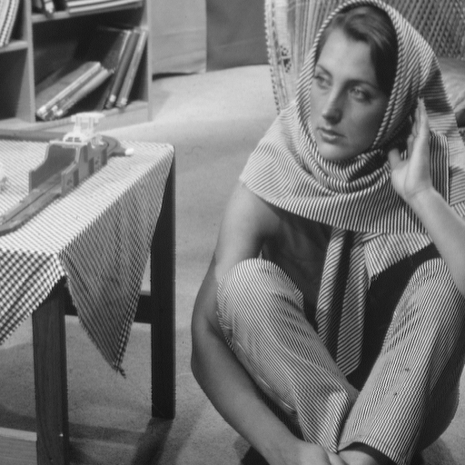

# BdCNN
The code is associated with the following paper:

Ryo Abiko, and Masaaki Ikehara. "Blind Denoising of Mixed Gaussian-impulse Noise by Single CNN." ICASSP 2019-2019 IEEE International Conference on Acoustics, Speech and Signal Processing (ICASSP). IEEE, 2019.

|Noisy image|Denoised image|Ground truth image|
|:--:|:--:|:--:|
||||

## Usage
Our code is based on MATLAB.
If GPU is available, MATLAB will run the code on GPU automatically.

run `demo.m`

To select the GPU, run `gpuDevice(number)` before running the demo file.

## Citation
Please cite this paper if you use this code. 

```
@inproceedings{abiko2019blind,
  title={Blind Denoising of Mixed Gaussian-impulse Noise by Single CNN},
  author={Abiko, Ryo and Ikehara, Masaaki},
  booktitle={ICASSP 2019-2019 IEEE International Conference on Acoustics, Speech and Signal Processing (ICASSP)},
  pages={1717--1721},
  year={2019},
  organization={IEEE}
}
```


For further information, please contact: {abiko, ikehara}@tkhm.elec.keio.ac.jp
